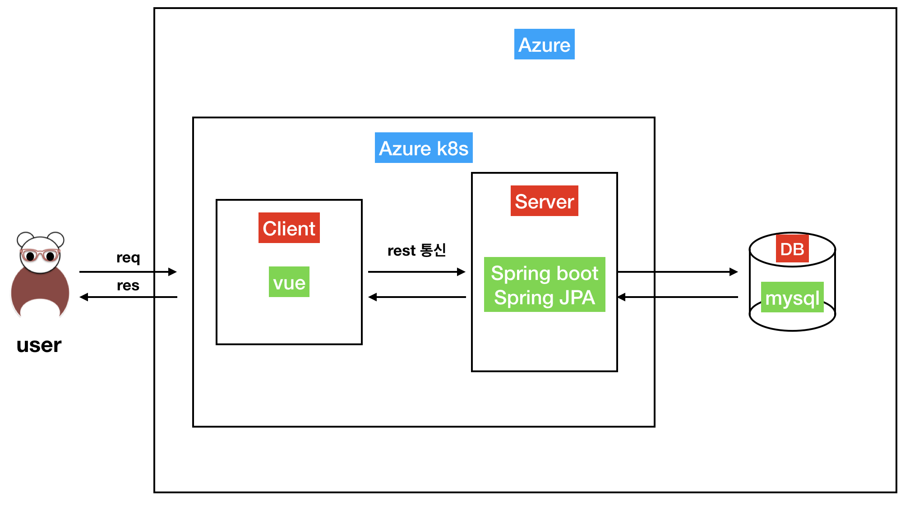
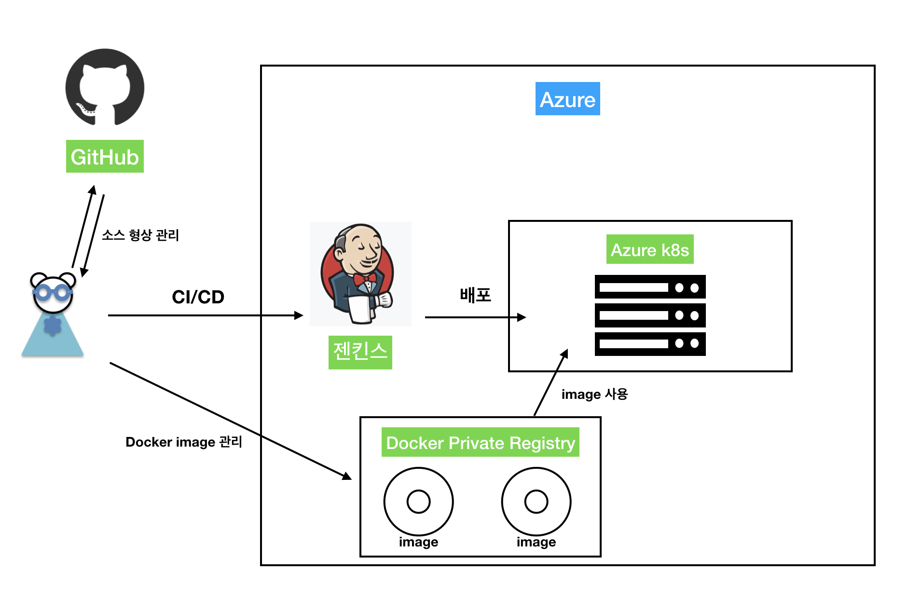

# 쓸애기스터디 블로그 만들기

### 1. Story Board

- [KEYNOTE](./ztc/images/makeBlog.pdf)

### 2. 개발 구성도
```
맘껏 변경 가능. images 폴더에 키노트 있음
```


### 3. 배포 구상도
```
역시나 맘껏 변경 가능. images 폴더에 키노트 있음
젠킨스는 고민좀 해봐야 될듯
```


### 4. 역할 분배
- client : 이상준
- server : 박지홍, 우영선
- 서버 구성 & 배포 : 박광태
- 자기 땡기는대다 이름 추가합시다.

### 5. 일정
- 1차 (8/29)
    - 주제 선정 (블로그 개발)
    - 역할 분배
    - slack 생성
    - github 생성
- 2차 (9/14)  
    - 화면 구성도 정리
    - 기능 내역 정리
    - api 명세서
    - aks 구성 완료
    - mysql 구성 완료
- 3차 (9/18)
    - front 기초 틀 완성
    - 각자 공부함
    - 차주 스터디 시에 배포 목표 (기본기능)
- 4차 (9/26)
    - 로컬 배포환경 구성 완료 (aks + acr)
    - front 개선 : 글쓰기 페이지, Board 페이지 생성
    - back 개선 : list, write 기능 개발
    - 블로그 주소 : http://52.170.95.198 (추후 도메인 등록)
    - 전주 해장국 감자탕 회식 (존맛이라 술 오지게먹음)
- 5차 (10/16)
    - 전주 해장국 감자탕집에서 만남 (또 술 오지게먹음)
    - (비대위) 박광태 40만원 구하기 - 애져에서 돈안받음
    - 서버는 어디에.. 
    - 서버 라즈베리파이 || 네이버 클라우드 
- 6차 (11/15)
    - 블로그 개발에서 방향을 바꿈.
    - 자바 프로그래밍 면접, 이렇게 준비한다 2장씩 읽고 발표
    - 각자 아는 기술 주마다 번갈아 가면서 공유
    - Util class 짜기 (책 다읽고)
    - 무슨 훠궈집감

### 6. 사용 기술 목록
- spring boot
- jpa
- aks
- mysql
- vue.js
